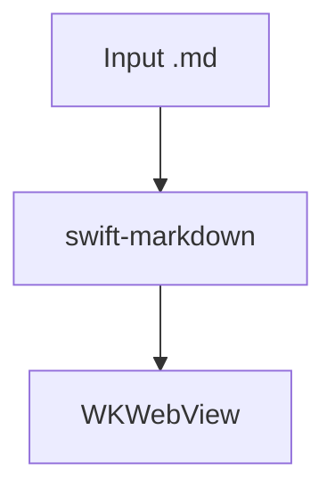

# MD Preview App — macOS Markdown Viewer

> Skill by [ara.so](https://ara.so) — Daily 2026 Skills collection.

A fast, native macOS app (AppKit + WKWebView) for reading `.md` files. No Electron, no browser tab. Features include a document outline sidebar, Mermaid diagram rendering, KaTeX math, Quick Look extension, in-document search, and one-click "Open With" for popular editors.

---

## Installation

### Pre-built (recommended)
Download the signed and notarized DMG from the [Releases page](https://github.com/pluk-inc/md-preview.app/releases) and drag to `/Applications`.

### Build from source
```sh
git clone git@github.com:pluk-inc/md-preview.app.git
cd md-preview.app
open md-preview.xcodeproj
# Build and run the `md-preview` scheme
# SPM resolves Sparkle + swift-markdown on first build
```

**Requirements:** macOS 15+, Xcode with Swift 6.0, Apple Silicon or Intel.

---

## Project Layout

```
md-preview/         # Main app target (AppKit, WKWebView)
quick-look/         # Quick Look extension (.appex)
scripts/            # Release & rollback automation
Version.xcconfig    # MARKETING_VERSION + CURRENT_PROJECT_VERSION
appcast.xml         # Sparkle update feed
```

---

## Key Dependencies (Swift Package Manager)

| Package | Purpose |
|---|---|
| `swift-markdown` (Apple) | Markdown parsing via cmark-gfm |
| `Sparkle` | Auto-update framework |
| Mermaid (bundled JS) | Fenced `mermaid` block rendering |
| KaTeX (bundled JS) | LaTeX math rendering |

---

## Core Architecture

### Markdown → HTML Pipeline

```swift
import Markdown

// Parse a markdown string into a Document
let source = try String(contentsOf: fileURL, encoding: .utf8)
let document = Document(parsing: source)

// Walk the document tree to build HTML + extract headings for TOC
struct HTMLRenderer: MarkupVisitor {
    typealias Result = String

    mutating func visitDocument(_ document: Document) -> String {
        document.children.map { visit($0) }.joined()
    }

    mutating func visitHeading(_ heading: Heading) -> String {
        let text = heading.plainText
        let anchor = text.lowercased()
            .replacingOccurrences(of: " ", with: "-")
            .filter { $0.isLetter || $0.isNumber || $0 == "-" }
        let level = heading.level
        return "<h\(level) id=\"\(anchor)\">\(text)</h\(level)>\n"
    }

    mutating func visitParagraph(_ paragraph: Paragraph) -> String {
        "<p>\(paragraph.children.map { visit($0) }.joined())</p>\n"
    }

    mutating func visitCodeBlock(_ codeBlock: CodeBlock) -> String {
        let lang = codeBlock.language ?? ""
        if lang == "mermaid" {
            // Render as Mermaid diagram via bundled mermaid.min.js
            return "<div class=\"mermaid\">\(codeBlock.code)</div>\n"
        }
        if lang == "math" {
            // Render as KaTeX display math
            return "<div class=\"math-display\">$$\(codeBlock.code)$$</div>\n"
        }
        return "<pre><code class=\"language-\(lang)\">\(codeBlock.code)</code></pre>\n"
    }
}
```

### Loading HTML into WKWebView

```swift
import WebKit

class PreviewViewController: NSViewController, WKNavigationDelegate {
    let webView = WKWebView()

    func loadMarkdown(from url: URL) {
        let source = try! String(contentsOf: url, encoding: .utf8)
        var renderer = HTMLRenderer()
        let body = renderer.visit(Document(parsing: source))
        let html = wrapInTemplate(body)

        // Load with base URL so bundled assets (mermaid, KaTeX) resolve
        let resourceURL = Bundle.main.resourceURL!
        webView.loadHTMLString(html, baseURL: resourceURL)
    }

    // Handle navigation: open external links in default browser
    func webView(_ webView: WKWebView,
                 decidePolicyFor action: WKNavigationAction,
                 decisionHandler: @escaping (WKNavigationActionPolicy) -> Void) {
        if action.navigationType == .linkActivated,
           let url = action.request.url,
           url.scheme == "https" || url.scheme == "http" {
            NSWorkspace.shared.open(url)
            decisionHandler(.cancel)
        } else {
            decisionHandler(.allow)
        }
    }
}
```

### Document Outline (TOC) Sidebar

```swift
struct HeadingItem: Identifiable {
    let id = UUID()
    let level: Int
    let text: String
    let anchor: String
}

// Extract headings while parsing
func extractHeadings(from document: Document) -> [HeadingItem] {
    var headings: [HeadingItem] = []
    for child in document.children {
        if let heading = child as? Heading {
            let text = heading.plainText
            let anchor = text.lowercased()
                .replacingOccurrences(of: " ", with: "-")
            headings.append(HeadingItem(level: heading.level,
                                        text: text,
                                        anchor: anchor))
        }
    }
    return headings
}

// Jump to heading via JavaScript
func scrollTo(anchor: String) {
    let js = "document.getElementById('\(anchor)')?.scrollIntoView({behavior:'smooth'})"
    webView.evaluateJavaScript(js, completionHandler: nil)
}
```

---

## Quick Look Extension

The extension lives in `quick-look/` and is a separate `.appex` target. It reuses the same HTML rendering pipeline so Mermaid diagrams and math work offline in Finder spacebar previews.

```swift
// quick-look/PreviewViewController.swift (skeleton)
import Quartz

class PreviewViewController: NSViewController, QLPreviewingController {
    func preparePreviewOfFile(at url: URL,
                              completionHandler: @escaping (Error?) -> Void) {
        let source = try! String(contentsOf: url, encoding: .utf8)
        var renderer = HTMLRenderer()
        let html = wrapInTemplate(renderer.visit(Document(parsing: source)))
        let base = Bundle.main.resourceURL!
        webView.loadHTMLString(html, baseURL: base)
        completionHandler(nil)
    }
}
```

---

## Mermaid Diagrams

Fenced `mermaid` blocks are detected during parsing and emitted as `<div class="mermaid">` elements. The bundled `mermaid.min.js` initializes on page load — no CDN required.

**Markdown input:**
````markdown

````

**HTML template snippet (how it's wired):**
```html
<script src="mermaid.min.js"></script>
<script>mermaid.initialize({ startOnLoad: true, theme: 'default' });</script>
```

---

## KaTeX Math

| Syntax | Usage |
|---|---|
| `$x^2 + y^2$` | Inline math |
| `$$\int_0^1 f(x)\,dx$$` | Display math |
| ` ```math ` block | Fenced display math |

Copying a rendered formula pastes the original LaTeX source (via the bundled `copy-tex` KaTeX extension).

---

## "Open With" Editor Integration

The app queries Launch Services for apps that declare an editor role for Markdown UTIs, filters to known editors, and remembers your pick.

```swift
let mdUTI = UTType("net.daringfireball.markdown")!
let editors = NSWorkspace.shared.urlsForApplications(
    toOpen: fileURL  // or query by UTI
).filter { url in
    let knownEditors = ["com.microsoft.VSCode",
                        "com.todesktop.230313mzl4w4u92",  // Cursor
                        "dev.zed.zed", "com.sublimetext.4",
                        "com.barebones.bbedit", "com.panic.Nova",
                        "com.coteditor.CotEditor", "com.macromates.TextMate",
                        "org.vim.MacVim", "com.apple.dt.Xcode",
                        "com.apple.TextEdit"]
    let bundleID = Bundle(url: url)?.bundleIdentifier ?? ""
    return knownEditors.contains(bundleID)
}

// Open the file in chosen editor
NSWorkspace.shared.open([fileURL],
                        withApplicationAt: editorURL,
                        configuration: .init(),
                        completionHandler: nil)
```

---

## Share / Copy Source

The Share toolbar item feeds the Markdown *text* (not a file URL) to `NSSharingServicePicker`, so **Copy** writes raw Markdown to the clipboard — ideal for pasting into ChatGPT or Claude.

```swift
// Wire up the share button
@objc func shareDocument(_ sender: NSToolbarItem) {
    let source = try! String(contentsOf: currentFileURL, encoding: .utf8)
    let picker = NSSharingServicePicker(items: [source])
    picker.show(relativeTo: .zero, of: sender.view!, preferredEdge: .minY)
}
```

---

## In-Document Search

Standard `WKWebView` find interaction — no custom implementation needed:

```swift
// Enable find bar (macOS 12+)
webView.configuration.preferences.setValue(true,
    forKey: "developerExtrasEnabled")

// Trigger search (connect to ⌘F)
@objc func performFindPanelAction(_ sender: Any?) {
    webView.performFindPanelAction(sender)
}
// ⌘G / ⌘⇧G handled automatically by WKWebView
```

---

## Supported File Types

| Extension | UTI |
|---|---|
| `.md`, `.markdown`, `.mdown` | `net.daringfireball.markdown` |
| `.txt` | `public.plain-text` |

Register in `Info.plist` under `CFBundleDocumentTypes` and `UTImportedTypeDeclarations`.

---

## Releasing

Releases use [Amore](http://amore.computer/) for signing, notarization, DMG, S3 upload, and Sparkle appcast.

```sh
# 1. Bump versions (single source of truth)
# Edit Version.xcconfig:
#   MARKETING_VERSION = 1.2.0
#   CURRENT_PROJECT_VERSION = 42

# 2. Run release script
./scripts/release.sh

# 3. Roll back a bad release
./scripts/rollback-release.sh
```

---

## Contributing Workflow

```sh
# Fork, then:
git clone https://github.com/YOUR_FORK/md-preview.app.git
cd md-preview.app

# Create a feature branch
git checkout -b feature/my-change

# Open in Xcode, build the `md-preview` scheme
open md-preview.xcodeproj

# Manual smoke test before PR:
# - Drop a .md with headings, mermaid blocks, and math onto the app
# - Verify TOC sidebar, diagram render, math render
# - Test Quick Look (spacebar in Finder)
# - Test "Open With" menu

git push origin feature/my-change
# Open PR against main
```

**PR guidelines:**
- One logical change per PR
- Open an issue first for larger changes
- Match existing Swift style (no formatter enforced — mirror nearby code)
- No UI test suite yet; manual smoke test required for UI changes

---

## Troubleshooting

| Problem | Fix |
|---|---|
| Mermaid diagrams blank | Check `baseURL` points to app bundle resources; `mermaid.min.js` must be in the Copy Bundle Resources phase |
| KaTeX not rendering | Same — verify `katex.min.js`, `katex.min.css`, and `copy-tex.min.js` are in bundle resources |
| Quick Look shows plain text | Re-run `qlmanage -r` to reset Quick Look daemon: `qlmanage -r && qlmanage -r cache` |
| SPM not resolving | `File → Packages → Reset Package Caches` in Xcode |
| Notarization issues | Use Amore or check `xcrun notarytool` — requires `APPLE_ID`, `TEAM_ID`, and an app-specific password |
| App not set as default handler | Delete `~/Library/Preferences/com.apple.LaunchServices.QuarantineEventsV2` and re-register via `LSSetDefaultHandlerForURLScheme` or the app's first-launch prompt |

```sh
# Reset Quick Look plugin cache after building
qlmanage -r
qlmanage -r cache
# Test Quick Look directly
qlmanage -p /path/to/file.md
```
